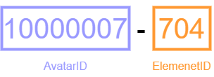
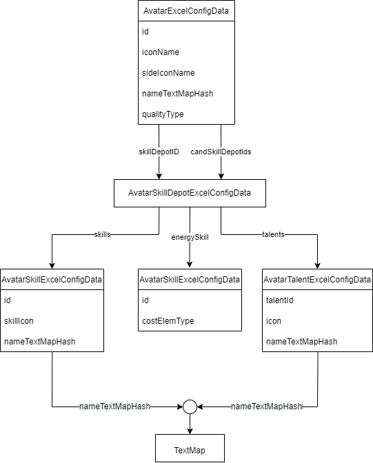

## Update
I found new source for get new excel data. So I will come back and auto update library again.

And unfortunately, I can't to tell where source excel data.

Anyway, Thank you everyone use this project🙏

So let's begin 🤩

- M-307

# EnkaNetwork.py (JSON Data)
Repository for format **Excel data** to use [EnkaNetwork.py](https://github.com/mrwan200/EnkaNetwork.py) python library.

## ❓ Why not use EnkaNetwork store data?
I want some data like Skill name, Constellations data fully, FIGHT_PROP name but In EnkaNetowork prepare not fully served data. So I have to make this.

## ❓ How you fetch raw JSON data?
I fetch JSON data from some repo

## ❓ How to get export data?
Yon can see in [exports](./exports/) folder.

## ❓ How do I know this repo has been updated?
In every 00:00 (UTC+7) it's will be fetch last data from some repo
and check if commit is different from last commit. If different, it will update data take a 3 - 5 minutes to update data.

## ❓ Why avatar id has "10000005-503" or "10000007-702"?
In default character player. It's can't be to detect what is character element? so I join AvatarID and ElemenetID (candSkillDepotIds) like picture this:

And yeah, I use pattern to detect character element. from repo [EnkaNetwork/API-docs](https://github.com/EnkaNetwork/API-docs) store 😅.

## ❓ Can I use this repo for something else?
Sure.

## ❓ How to link character data like skill, talents and more?
You can see in picture this:

# Enjoy
